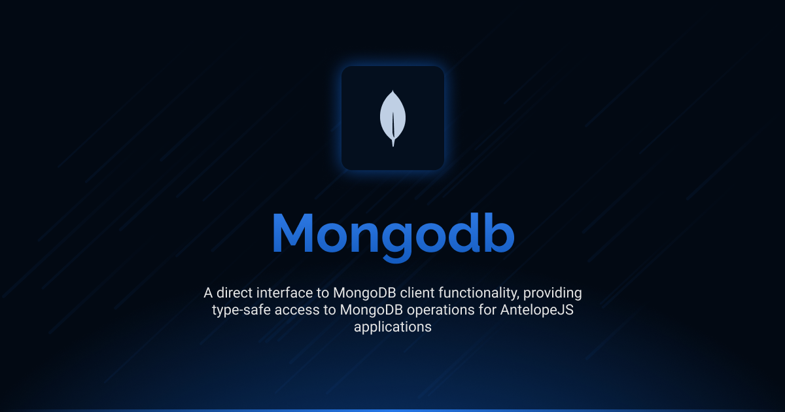

# Interface MongoDB

[](LICENSE.md)
[](https://github.com/antelopejs/antelope)

A direct interface to MongoDB client functionality. Interface MongoDB provides access to the underlying MongoDB client instance, allowing advanced operations using the raw MongoDB driver with full TypeScript support.

## Installation

```bash
ajs module imports add mongodb@beta
```

## Documentation

Detailed documentation is available in the `docs` directory:

- [Index](./docs/index.md) - Core functionality and usage examples

## Current Status

This is the development version (`beta`) of the Interface MongoDB. It is currently in pre-release stage and may undergo changes before the final release. The interface is not considered stable for production use without understanding that breaking changes may occur.

## License

This project is licensed under the Apache License 2.0 - see the [LICENSE.md](LICENSE.md) file for details.
